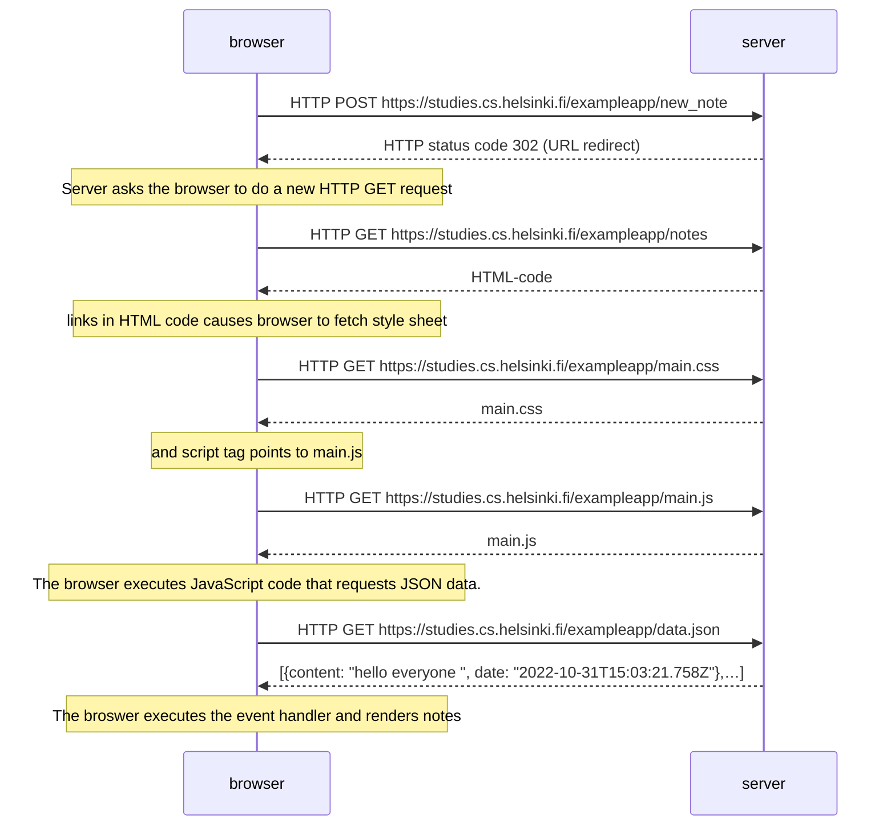
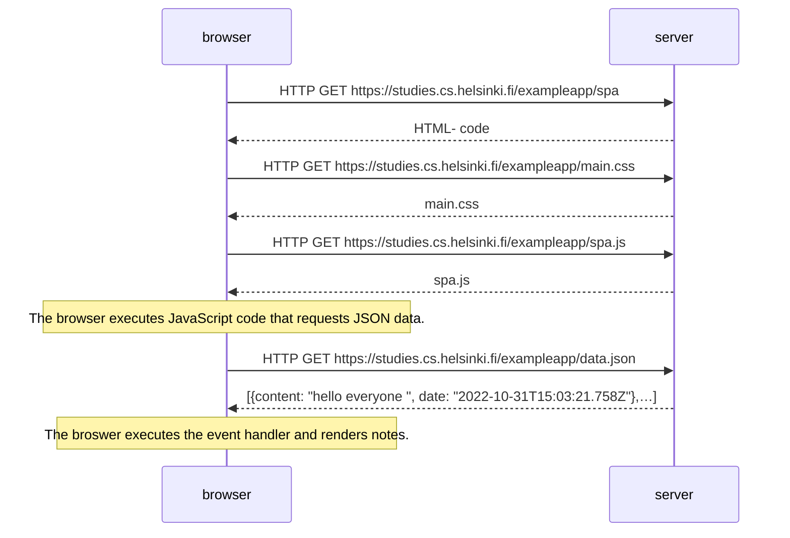
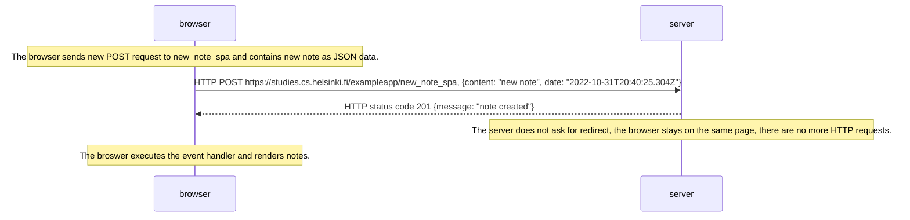

# Part 0 - Fundamentals of Web apps

Sequence diagrams are made using [Mermaid](https://mermaid-js.github.io/mermaid/#/sequenceDiagram) syntax for each exercise and depict the interaction between the browser and server in different situations.

## 0.4: New note

## 0.5: Single page app

## 0.6: New note

